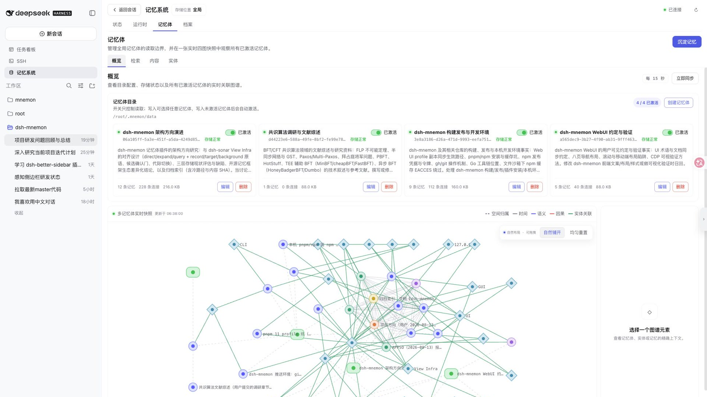

<h1 align="center">dsh-mnemon</h1>

<p align="center"><strong>简体中文</strong> | <a href="./README.en.md">English</a></p>

<p align="center">
  <a href="./docs/zh-CN/project-overview.md">
    
  </a>
</p>

> **[Mnemon](https://github.com/mnemon-dev/mnemon) 与 DSH 的深度集成，为 DSH 提供完备的记忆系统能力。**

`dsh-mnemon` 是 DeepSeek Harness（DSH）的本地 Mnemon 记忆插件。它把每轮可见的运行时热记忆、可直接阅读的项目档案（Documents）和按需召回的长期记忆体（Memory Spaces）组织成一个受监督、可检索、可维护的三层体系。

插件把 Mnemon 的长期记忆体能力接入 DSH，并补充 Runtime Memory、Documents、生命周期、受限子 Agent、WebUI、命令和权限边界。当前用户指令和仓库事实始终高于历史记忆。

> **What's more?** 更多 DSH Native 能力支持正在路上。**Memory to View.**

## 实机演示


## 三层记忆

| 层级 | 适合保存 | 如何记住 | 如何进入上下文 |
|---|---|---|---|
| 运行时热记忆 | 用户偏好、稳定约定、环境事实、常用经验 | 显式操作或合格的后台审查更新 `memories.json`，再生成 `USER.md` / `MEMORY.md` 投影 | 每轮直接注入 |
| 项目档案 | 设计、调查、流程、架构理由、交接材料 | 创建或更新受管 Markdown 与 `index.json`；整理容量时先建立 Mnemon 冷引用，再迁移原文 | 先检索 active Documents，再按需读取全文 |
| 记忆体 | 跨会话的长期事实、决策、实体与关系 | 受限 `spawn` worker 选择最窄空间并查重，通过 Mnemon `remember` / `link` 写入四图 | 只从已激活 Memory Spaces 按需召回 |

```text
当前任务产生的可复用信息
          |
          +-- 短小、稳定、每轮常用
          |      主 Agent / 合格的 fork 审查
          |                 |
          |      add | replace | remove
          |                 v
          |      memories.json（权威源）
          |                 |
          |      USER.md + MEMORY.md ----------> 每轮 prompt
          |
          +-- 完整设计、调查、流程与交接
          |      主 Agent / 合格的 fork 审查
          |                 |
          |          create | update
          |                 v
          |      index.json + active/*.md ------> 检索后按需全文
          |                 |
          |      Mnemon 冷引用 -> archived/*.md（容量整理）
          |
          `-- 跨会话事实、决策、实体与关系
                    主 Agent
                       |
              spawn：选空间 / 查重 / 写入
                       v
              Mnemon CLI -> <space>/mnemon.db
                       |
              spawn：仅召回 active 空间 -------> 有界证据
```

## 核心能力

- 主动记忆路由：内置 Prompt、生命周期提示与工具说明会启发 LLM 按需调用全部读写能力；用户明确要求回顾、记住、修改、忘记或建档时，会自动选择对应层级和操作。
- 统一的 `global`、`workspace` 或 `custom` 存储范围，覆盖三层数据。
- 多记忆体目录：每个记忆体拥有稳定 ID、名称、路由说明、激活状态和独立 `mnemon.db`。
- 受限子 Agent：长期召回与语义写入使用隔离的 `spawn` worker；后台审查使用继承已完成 checkpoint 的 `fork` worker。
- 可靠容量维护：USER 热记忆在本地保守合并，MEMORY 热记忆先归档再压缩，Documents 先建立冷索引再迁移；revision 冲突时保留原数据。
- DSH 原生体验：模型工具、`/mnemon` 命令、双语 Web 工作台、全局明暗主题和诊断状态页。
- 本地优先：CLI 以参数数组启动且禁用 shell；数据库和文档不需要远程记忆服务。

## 前置条件

- 可用的 DSH Web profile。
- 本地 `mnemon` CLI。
- 支持 `outputSchema`、`toolFilter`、`persona` 和 `depthLimit` 的子 Agent provider。常规语义操作优先使用 `spawn`；默认后台审查还需要名为 `fork`、可继承父上下文的 provider。

**兼容基线**：`dsh-mnemon` 0.1.0 已在 `@deepseek-ai/dsh` 0.1.0-rc.6（2026-08-13 快照）的 live web profile 上实测通过，最后验证日期 2026-08-14。插件不声明固定的最低版本矩阵；DSH 迭代快，升级前先在隔离 profile 或已备份的数据目录中复跑[快速开始](./docs/zh-CN/getting-started.md)的验证步骤。

## 快速开始

安装 Mnemon：

```sh
# macOS
brew install --cask mnemon-dev/tap/mnemon

# macOS / Linux，也可通过 Go 安装
go install github.com/mnemon-dev/mnemon@latest

mnemon --version
```

安装插件并重启 DSH Web profile：

```sh
dsh plugin --profile web add dsh-mnemon
dsh --profile web
```

未发布到 npm 的预发布版本可从 git 安装：

```sh
dsh plugin --profile web add "github:omdsh-dev/dsh-mnemon"
```

本地开发检出使用绝对路径：

```sh
dsh plugin --profile web add "link:/absolute/path/to/dsh-mnemon"
```

打开 DSH 的“设置 -> 记忆系统”独立配置页即可选择展示形态与存储范围。默认 `sidebar` 从左侧栏进入独立“记忆系统”工作台，并使用对齐 DSH 官方面板的纯文字标题、无 Mnemon Logo 极简皮肤；切换为 `buildin` 则恢复原有的对话区内嵌标签页及其既有视觉，保存后实时切换且不会重复挂载。两种形态共享全部功能和数据流，外观定义彼此隔离。Sidebar 顶栏从首帧起就在标题后显示存储位置模式；`workspace` 范围下继续提供独立的查看工作区选择器，并在查看目标不同于对话实际工作区时显示紧凑的一键对齐模块。切换查看工作区会先卸载旧工作区的卡片、筛选、弹窗和滚动状态，再加载新目录，避免旧内容与新操作目标短暂混用。路径差异保留在对齐模块的可访问说明和悬停提示中；Agent、工具和生命周期仍始终使用当前会话工作区。Sidebar 右侧连接状态只显示“已连接”，Buildin 保持原有状态摘要。存储根会在新目录初始化成功后原子切换；保存存储范围、目录或其他核心配置后，前端立即清除旧页状态并自动重新读取当前页，无需手动刷新浏览器。切换范围不会自动迁移、合并或删除旧数据。

升级与卸载（`dsh plugin` 转发给 profile 目录下的 pnpm）：

```sh
# 升级
dsh plugin --profile web update dsh-mnemon

# 卸载（同时从 profile 移除其 bundle 注册）
dsh plugin --profile web remove dsh-mnemon
```

卸载不会删除记忆数据：`global` 范围数据留在 `~/.mnemon`，`workspace` / `custom` 范围数据留在对应目录，重新安装后即可继续使用。若只想临时停用自动读写而不卸载，可在插件配置里关闭 `writebackMode` / `recallMode` / `lifecycleEnabled`；`tabEnabled=false` 可隐藏当前展示形态的 Web 入口（详见[配置参考](./docs/zh-CN/configuration.md)）。

## 最小配置

配置位于 `$DSH_HOME/settings.yaml`（默认通常为 `~/.dsh/settings.yaml`）：

```yaml
mnemon:
  displayMode: sidebar # sidebar | buildin；默认 sidebar
  storageScope: global # global | workspace | custom
```

- `global`：`MNEMON_DATA_DIR`，未设置时为 `~/.mnemon`。
- `workspace`：每个 DSH 工作区各自根目录下的 `.mnemon`；Agent 执行跟随当前会话工作区，Web 工作台可独立选择查看目标。
- `custom`：`dataDir` 指定的绝对路径或 `~/...` 路径。

完整配置、覆盖优先级和只读模式见[配置参考](./docs/zh-CN/configuration.md)。

## 使用入口

默认 Sidebar 工作台使用「状态、运行时、记忆体、档案」四个一级标签；记忆体保留标题与用途说明，其下再提供「概览、检索、内容、实体」，「沉淀记忆」作为右侧主操作。运行时记忆、记忆体和项目档案统一采用“标题区右侧添加、下方查看/检索”的结构，添加与编辑均打开 DSH 风格弹窗；记忆体目录卡片把激活开关固定在右上角，把编辑、删除放在稳定的底部操作区，物理删除必须经过危险操作确认。Sidebar 的一级页头会在内容滚动时保持可见，记忆体内「概览、检索、内容、实体」的二级内容标题则随内容正常滚动；检索结果、实体与内容列表采用“当前数量 / 总数 + 加载更多”，运行时合并为带真实标签外形、可按 USER / MEMORY 筛选和按内容查询的单列列表，档案目录分批展示且桌面端正文使用独立阅读滚动区。主操作、编辑、危险操作和查看操作分别使用蓝色实心、蓝色描边、红色和中性层级。字体、按钮、下拉框和表单密度与任务看板、SSH 面板保持一致；字段内容和选项使用正常字重，只有必要的标题与标签保留强调。切换页面会在绘制前复位滚动位置。Buildin 继续保留原有八页分组导航、内联表单和既有视觉。侧栏入口、工作台标题、全部功能文案和时间格式都会随 DSH 全局语言即时切换，无需刷新。

记忆也会在对话流中直接体现（对话内交互，**默认开启**，可在「设置 → 记忆系统 → 对话界面」中逐项关闭，保存即实时生效）：

- **回合记忆条**：完成的回合若触及记忆，回合尾会按成功结果区分召回、沉淀、档案检索和检查，并单独标出失败数；展开后点击具体工具名会打开对应的记忆页面；
- **存入记忆**：每条已定稿的助手回复旁有一个与原生操作栏对齐的记忆图标；悬停显示简短功能说明，点击后先弹出确认与可编辑候选，确认提交才会交给隔离的记忆子 Agent 判断、查重并沉淀，不占用主对话上下文。

常用命令：

```text
/mnemon status
/mnemon recall <查询>
/mnemon related <完整记忆 ID>
/mnemon remember <稳定、自包含的长期洞察>
/mnemon forget <完整记忆 ID>
```

推荐的查询顺序是：热记忆 -> active Documents -> 已激活记忆体 -> 命中记录指向的归档原文。不要把临时进度、原始日志、秘密或可直接从仓库重新获得的普通事实写入长期记忆。

## 权限与数据

- **文件**：通过本地 `mnemon` CLI 读写数据目录——`global` 范围是 `~/.mnemon`，`workspace` / `custom` 范围是用户指定的目录；插件不直接写这些目录，WebUI 也不直接读 SQLite。`sourcePaths` 不能逃出发起会话的工作区，也不能指向受管 Documents 目录。
- **进程**：`mnemon` 以参数数组启动且禁用 shell，输出有上限，超时先 `SIGTERM` 再 `SIGKILL`。
- **网络**：插件与 Mnemon 均本地运行，不发起远程调用；子 Agent 的模型推理走 DSH 已有的 provider 连接。
- **凭据**：插件不存储、不读取任何凭据或 API key，模型凭据完全由 DSH 与 provider 管理。
- **用户数据**：记忆内容（用户画像、项目档案、长期记忆）全部落在本地 SQLite / JSON，不会上传。
- **诚实披露**：当前没有确定性的凭据/秘密检测器，请勿向热记忆、Documents 或 Memory Spaces 写入密钥、token 或私钥。完整边界（进程/文件/Web/模型）与备份恢复见[运维、安全与故障排查](./docs/zh-CN/operations.md)。

## 文档

- [文档中心](./docs/zh-CN/README.md)
- [项目介绍](./docs/zh-CN/project-overview.md)
- [快速开始](./docs/zh-CN/getting-started.md)
- [架构设计](./docs/zh-CN/architecture.md)
- [存储与三层记忆模型](./docs/zh-CN/storage-model.md)
- [生命周期与核心流程](./docs/zh-CN/workflows.md)
- [配置参考](./docs/zh-CN/configuration.md)
- [WebUI、工具、命令与 RPC](./docs/zh-CN/interfaces.md)
- [运维、安全与故障排查](./docs/zh-CN/operations.md)
- [开发与验证](./docs/zh-CN/development.md)
- [Roadmap](./docs/zh-CN/roadmap.md)

## 开发

```sh
pnpm install
pnpm run verify
```

`verify` 依次运行 TypeScript 检查、Vitest 测试和生产构建。构建产物写入并提交到 `lib/`；详细发布与真实 WebUI 验证流程见[开发文档](./docs/zh-CN/development.md)。

## License

MIT。发现安全问题请通过 [SECURITY.md](./SECURITY.md) 中的渠道私下报告，不要直接开公开 issue。
