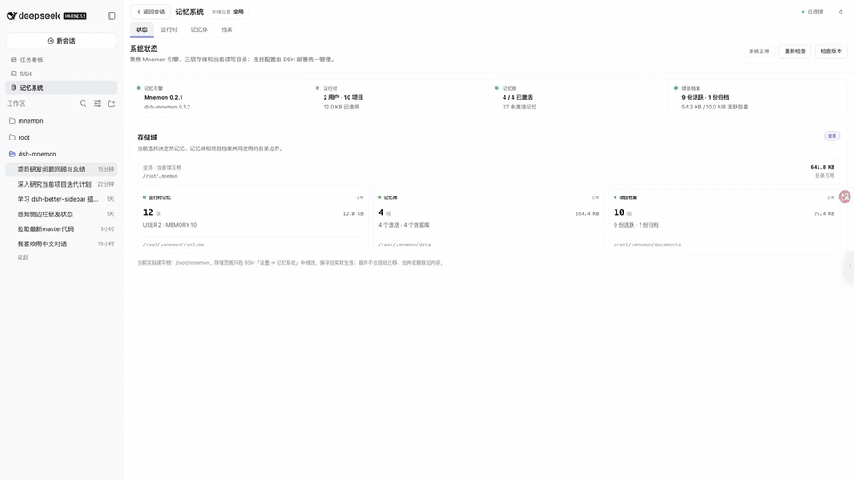
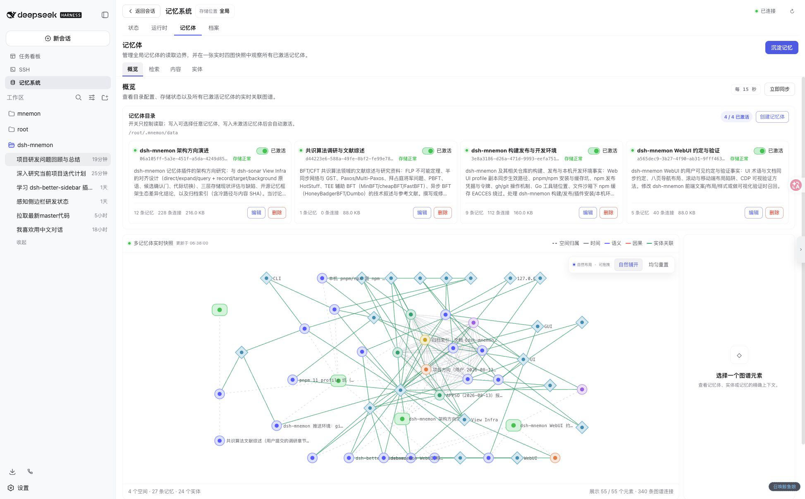

# dsh-mnemon

**简体中文** | [English](./README.en.md)

> **[Mnemon](https://github.com/mnemon-dev/mnemon) 与 DSH 的深度集成，为 DSH 提供完备的记忆系统能力。**

`dsh-mnemon` 是 DeepSeek Harness（DSH）的本地 Mnemon 记忆插件。它把每轮可见的运行时热记忆、可直接阅读的项目档案（Documents）和按需召回的长期记忆体（Memory Spaces）组织成一个受监督、可检索、可维护的三层体系。

插件把 Mnemon 的长期记忆体能力接入 DSH，并补充 Runtime Memory、Documents、生命周期、受限子 Agent、WebUI、命令和权限边界。当前用户指令和仓库事实始终高于历史记忆。

> **What's more?** 更多 DSH Native 能力支持正在路上。**Memory to View.**

## 实机演示



**README 内直接播放的 77 秒完整演示** — 实际操作状态、运行时记忆、多记忆体实时图谱、项目档案、图增强检索、实体聚合、监督写回与内容维护。也可[下载高清 MP4](./docs/assets/dsh-mnemon-memory-system-demo.mp4)。

## 三层记忆

| 层级 | 适合保存 | 如何记住 | 如何进入上下文 |
|---|---|---|---|
| 运行时热记忆 | 用户偏好、稳定约定、环境事实、常用经验 | 显式操作或合格的后台审查更新 `memories.json`，再生成 `USER.md` / `MEMORY.md` 投影 | 每轮直接注入 |
| 项目档案 | 设计、调查、流程、架构理由、交接材料 | 创建或更新受管 Markdown 与 `index.json`；整理容量时先建立 Mnemon 冷引用，再迁移原文 | 先检索 active Documents，再按需读取全文 |
| 记忆体 | 跨会话的长期事实、决策、实体与关系 | 受限 `spawn` worker 选择最窄空间并查重，通过 Mnemon `remember` / `link` 写入四图 | 只从已激活 Memory Spaces 按需召回 |

```text
当前任务产生的可复用信息
          |
          +-- 短小、稳定、每轮常用
          |      主 Agent / 合格的 fork 审查
          |                 |
          |      add | replace | remove
          |                 v
          |      memories.json（权威源）
          |                 |
          |      USER.md + MEMORY.md ----------> 每轮 prompt
          |
          +-- 完整设计、调查、流程与交接
          |      主 Agent / 合格的 fork 审查
          |                 |
          |          create | update
          |                 v
          |      index.json + active/*.md ------> 检索后按需全文
          |                 |
          |      Mnemon 冷引用 -> archived/*.md（容量整理）
          |
          `-- 跨会话事实、决策、实体与关系
                    主 Agent
                       |
              spawn：选空间 / 查重 / 写入
                       v
              Mnemon CLI -> <space>/mnemon.db
                       |
              spawn：仅召回 active 空间 -------> 有界证据
```

[](./docs/zh-CN/project-overview.md)

*多记忆体目录、激活状态与实时关系图。点击图片阅读[完整项目介绍](./docs/zh-CN/project-overview.md)。*

## 核心能力

- 主动记忆路由：内置 Prompt、生命周期提示与工具说明会启发 LLM 按需调用全部读写能力；用户明确要求回顾、记住、修改、忘记或建档时，会自动选择对应层级和操作。
- 统一的 `global`、`workspace` 或 `custom` 存储范围，覆盖三层数据。
- 多记忆体目录：每个记忆体拥有稳定 ID、名称、路由说明、激活状态和独立 `mnemon.db`。
- 受限子 Agent：长期召回与语义写入使用隔离的 `spawn` worker；后台审查使用继承已完成 checkpoint 的 `fork` worker。
- 可靠容量维护：USER 热记忆在本地保守合并，MEMORY 热记忆先归档再压缩，Documents 先建立冷索引再迁移；revision 冲突时保留原数据。
- DSH 原生体验：模型工具、`/mnemon` 命令、双语 Web 工作台、全局明暗主题和诊断状态页。
- 本地优先：CLI 以参数数组启动且禁用 shell；数据库和文档不需要远程记忆服务。

## 前置条件

- 可用的 DSH Web profile。
- 本地 `mnemon` CLI。
- 支持 `outputSchema`、`toolFilter`、`persona` 和 `depthLimit` 的子 Agent provider。常规语义操作优先使用 `spawn`；默认后台审查还需要名为 `fork`、可继承父上下文的 provider。

## 快速开始

安装 Mnemon：

```sh
# macOS
brew install --cask mnemon-dev/tap/mnemon

# macOS / Linux，也可通过 Go 安装
go install github.com/mnemon-dev/mnemon@latest

mnemon --version
```

安装插件并重启 DSH Web profile：

```sh
dsh plugin --profile web add "github:dsh-external/dsh-mnemon"
dsh --profile web
```

本地开发检出使用绝对路径：

```sh
dsh plugin --profile web add "link:/absolute/path/to/dsh-mnemon"
```

打开 DSH 的“设置 -> 插件配置 -> Mnemon”选择存储范围，再进入会话的“记忆系统”Tab 创建或激活记忆体。配置重启后生效；切换范围不会自动迁移、合并或删除旧数据。

## 最小配置

配置位于 `$DSH_HOME/settings.yaml`（默认通常为 `~/.dsh/settings.yaml`）：

```yaml
mnemon:
  storageScope: global # global | workspace | custom
```

- `global`：`MNEMON_DATA_DIR`，未设置时为 `~/.mnemon`。
- `workspace`：启动 DSH Host 时工作目录下的 `.mnemon`。
- `custom`：`dataDir` 指定的绝对路径或 `~/...` 路径。

完整配置、覆盖优先级和只读模式见[配置参考](./docs/zh-CN/configuration.md)。

## 使用入口

Web 工作台提供状态、运行时、记忆体、档案、沉淀、检索、实体、内容八个页面，分为三组：「状态」独立成第一组；「运行时、记忆体、档案」对应三层存储；「沉淀、检索、实体、内容」为读写工具。主要界面随 DSH 全局语言在中文与英文间切换。

常用命令：

```text
/mnemon status
/mnemon recall <查询>
/mnemon related <完整记忆 ID>
/mnemon remember <稳定、自包含的长期洞察>
/mnemon forget <完整记忆 ID>
```

推荐的查询顺序是：热记忆 -> active Documents -> 已激活记忆体 -> 命中记录指向的归档原文。不要把临时进度、原始日志、秘密或可直接从仓库重新获得的普通事实写入长期记忆。

## 文档

- [文档中心](./docs/zh-CN/README.md)
- [项目介绍](./docs/zh-CN/project-overview.md)
- [快速开始](./docs/zh-CN/getting-started.md)
- [架构设计](./docs/zh-CN/architecture.md)
- [存储与三层记忆模型](./docs/zh-CN/storage-model.md)
- [生命周期与核心流程](./docs/zh-CN/workflows.md)
- [配置参考](./docs/zh-CN/configuration.md)
- [WebUI、工具、命令与 RPC](./docs/zh-CN/interfaces.md)
- [运维、安全与故障排查](./docs/zh-CN/operations.md)
- [开发与验证](./docs/zh-CN/development.md)
- [Roadmap](./docs/zh-CN/roadmap.md)

## 开发

```sh
pnpm install
pnpm run verify
```

`verify` 依次运行 TypeScript 检查、Vitest 测试和生产构建。构建产物写入并提交到 `lib/`；详细发布与真实 WebUI 验证流程见[开发文档](./docs/zh-CN/development.md)。

## License

MIT。
