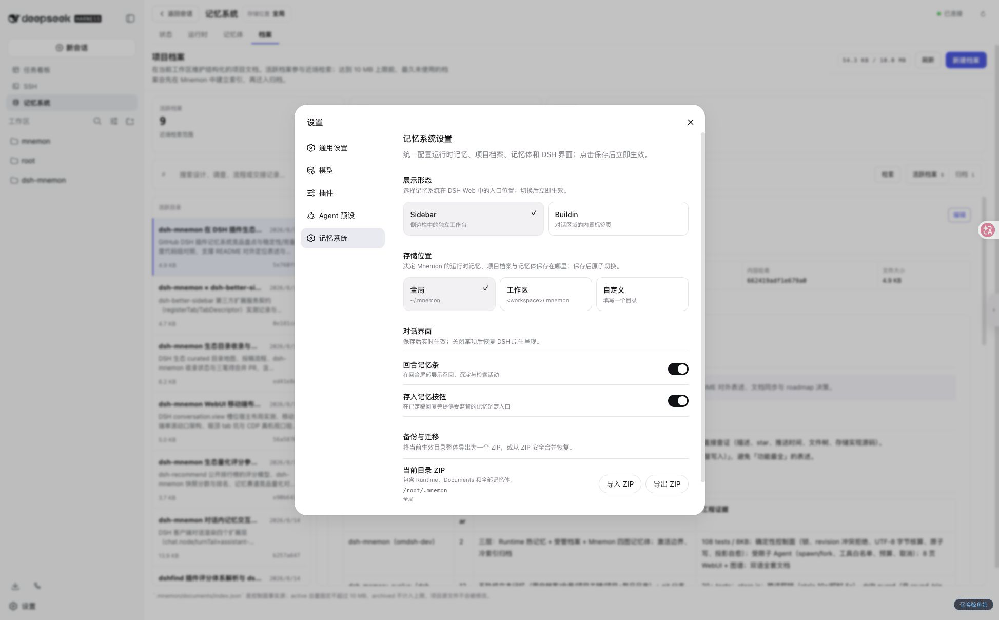
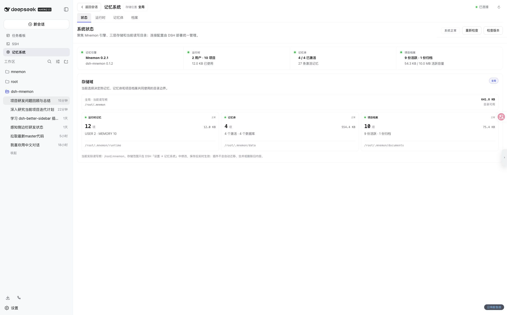
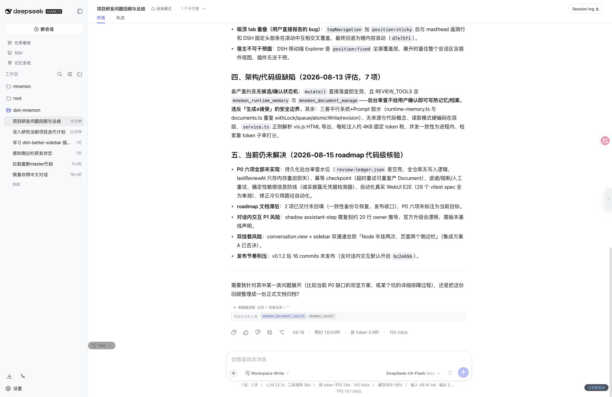

# Getting Started

[简体中文](../zh-CN/getting-started.md) | **English** | [Documentation hub](./README.md)

This guide goes from a blank environment to the first verified recall. It uses Sidebar and global storage by default. If installation is complete, jump to [First verification](#6-complete-first-verification).

## 1. Prerequisites

You need:

- a DSH Web profile that starts successfully;
- a locally executable `mnemon` CLI;
- a DSH subagent provider for isolated memory tasks.

Regular semantic work prefers a provider named `spawn` with `outputSchema`, `toolFilter`, `persona`, and `depthLimit`. Optional score-based background review additionally requires a provider named `fork` with `inheritsParentContext=true`. Missing `fork` does not block deterministic pages or regular manual actions.

The project does not declare a fixed minimum DSH / Mnemon matrix. This guide and its screenshots target dsh-mnemon v0.1.4. Back up and repeat this verification against an isolated root before upgrading.

## 2. Install Mnemon

Homebrew Cask is recommended on macOS:

```sh
brew install --cask mnemon-dev/tap/mnemon
```

Go works on macOS and Linux:

```sh
go install github.com/mnemon-dev/mnemon@latest
```

Verify the binary:

```sh
mnemon --version
```

On Windows, the official release provides ZIP archives for AMD64 and ARM64. The following PowerShell installs v0.2.3 under the auto-discovered per-user Programs directory and verifies it against the published checksum:

```powershell
$version = '0.2.3'
$arch = if ([System.Runtime.InteropServices.RuntimeInformation]::OSArchitecture -eq 'Arm64') { 'arm64' } else { 'amd64' }
$archiveName = "mnemon_${version}_windows_${arch}.zip"
$releaseBase = "https://github.com/mnemon-dev/mnemon/releases/download/v${version}"
$archive = Join-Path $env:TEMP $archiveName
$checksumFile = Join-Path $env:TEMP "mnemon_${version}_checksums.txt"
Invoke-WebRequest "${releaseBase}/${archiveName}" -OutFile $archive
Invoke-WebRequest "${releaseBase}/checksums.txt" -OutFile $checksumFile
$line = Get-Content $checksumFile | Where-Object { $_.EndsWith("  $archiveName") } | Select-Object -First 1
if (-not $line) { throw "Checksum entry not found for $archiveName" }
$expected = (($line -split '\s+')[0]).ToLowerInvariant()
$actual = (Get-FileHash -Path $archive -Algorithm SHA256).Hash.ToLowerInvariant()
if ($actual -ne $expected) { throw "Checksum mismatch for $archiveName" }
$installDir = Join-Path $env:LOCALAPPDATA 'Programs\mnemon'
New-Item -ItemType Directory -Force -Path $installDir | Out-Null
Expand-Archive -Path $archive -DestinationPath $installDir -Force
$mnemon = Join-Path $installDir 'mnemon.exe'
& $mnemon --version
```

Go remains an alternative when a Go toolchain is already available:

```powershell
go install github.com/mnemon-dev/mnemon@latest
$mnemonBin = go env GOBIN
if (-not $mnemonBin) {
  $mnemonBin = Join-Path (((go env GOPATH) -split ';')[0]) 'bin'
}
$mnemon = Join-Path $mnemonBin 'mnemon.exe'
& $mnemon --version
```

On Windows, dsh-mnemon discovers native `mnemon.exe` from `PATH`, an exported `GOBIN` or `GOPATH`, the default `%USERPROFILE%\go\bin`, `%LOCALAPPDATA%\Programs\mnemon`, and Program Files. `.cmd` and `.bat` wrappers are not accepted because CLI calls deliberately run without a shell.

If DSH still cannot find the binary, set `MNEMON_CLI_PATH` or add an absolute path to the user settings file instead of replacing the plugin's profile patch:

```yaml
mnemon:
  cliPath: 'C:\Users\alice\AppData\Local\Programs\mnemon\mnemon.exe'
```

`mnemon status` opens the effective Store and may initialize data or run upstream migrations, so it is not a side-effect-free installation probe.

## 3. Install dsh-mnemon

Install into the Web profile:

```sh
dsh plugin --profile web add dsh-mnemon
```

Use an absolute path for a development checkout:

```sh
dsh plugin --profile web add "link:/absolute/path/to/dsh-mnemon"
```

Then start or restart the profile:

```sh
dsh --profile web
```

Upgrade and uninstall:

```sh
dsh plugin --profile web update dsh-mnemon
dsh plugin --profile web remove dsh-mnemon
```

Uninstall removes the plugin registration, not memory data in global, workspace, or custom roots.

## 4. Choose entry point and storage

Open **Settings → Memory System**:

[](../assets/screenshots/settings-memory-system.png)

### Display mode

- **Sidebar** (default): a dedicated workbench opened from the DSH sidebar; recommended for most users.
- **Buildin**: the original conversation-area tab with its established visuals.

### Storage location

| Scope | Root | Best suited for |
|---|---|---|
| **Global** (default) | `MNEMON_DATA_DIR` or `~/.mnemon` | Sharing one memory set across workspaces |
| **Workspace** | `<workspace>/.mnemon` | Project isolation with cross-workspace inspection in the workbench |
| **Custom** | `dataDir` | A dedicated disk, mounted volume, or explicit directory |

Save initializes a candidate runtime graph before atomically switching the Host. The page clears stale state and reloads automatically—no browser refresh is needed. Changing scope never migrates, merges, or deletes old data.

In Workspace mode, the workbench selector changes only what data is being inspected. Agents, tools, and lifecycle hooks always use the current conversation's effective root. The header reports a mismatch and offers one-click alignment.

## 5. Open the Sidebar workbench

Click **Memory System** in the sidebar, then start on **Status**:

[](../assets/screenshots/status-overview.png)

Confirm that:

- the top right says Connected;
- Mnemon and dsh-mnemon show installed versions;
- the storage root matches your chosen scope;
- Runtime, Memory Spaces, and Documents report no errors.

If Mnemon is unavailable, run `command -v mnemon` and `mnemon --version` on macOS/Linux, or `Get-Command mnemon` and `Test-Path "$env:LOCALAPPDATA\Programs\mnemon\mnemon.exe"` on Windows PowerShell. See [Troubleshooting](./operations.md#troubleshooting) for other symptoms.

## 6. Complete first verification

### Create a Memory Space

1. Open **Memory Spaces → Overview**.
2. Select **Create Memory Space**.
3. Use a narrow name such as “Project Decisions.”
4. Describe what belongs there and which tasks should recall it.
5. Enable read activation.

### Remember one test item

Open **Remember** and enter something stable, self-contained, future-useful, and secret-free. Leave advanced options collapsed so the memory subagent can select a target, deduplicate, and distill.

Writing starts only after confirmation. Canceling the dialog changes no state.

### Verify recall

1. Open **Memory Spaces → Recall**.
2. Ask a concrete question that should match the item.
3. Use **Direct recall** first to inspect raw evidence.
4. Confirm the result retains its Memory Space, category, importance, score, and ID.

You can also use conversation commands:

```text
/mnemon status
/mnemon recall <focused query>
```

## 7. Verify memory inside a conversation

Ask a question that genuinely depends on history and allow the Agent to decide whether recall helps. After completion:

- Turn memory appears below the reply if the turn used memory tools.
- Expanding shows exact tools and links to their pages.
- Save to memory opens an editable confirmation; canceling performs no write.

[](../assets/screenshots/conversation-turn-memory.png)

Ordinary conversation should not force recall. Current requests, repository files, and live tool results outrank historical content.

## 8. Next steps

- Use the [Sidebar and conversation UI guide](./ui-guide.md) to learn every page.
- Use the [storage model](./storage-model.md) to choose Runtime, Documents, or Memory Spaces.
- Use the [configuration reference](./configuration.md) for Workspace scope, read-only behavior, and lifecycle switches.
- Use the [operations guide](./operations.md) to export your first ZIP backup and establish a pre-upgrade checklist.
