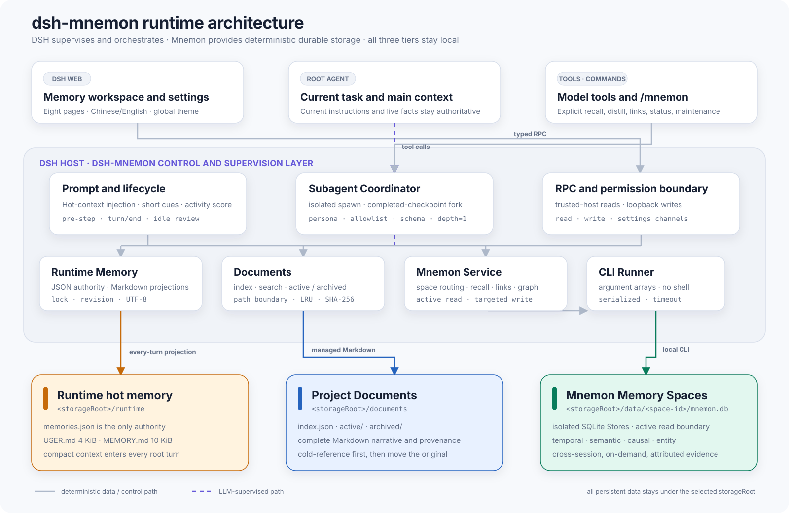
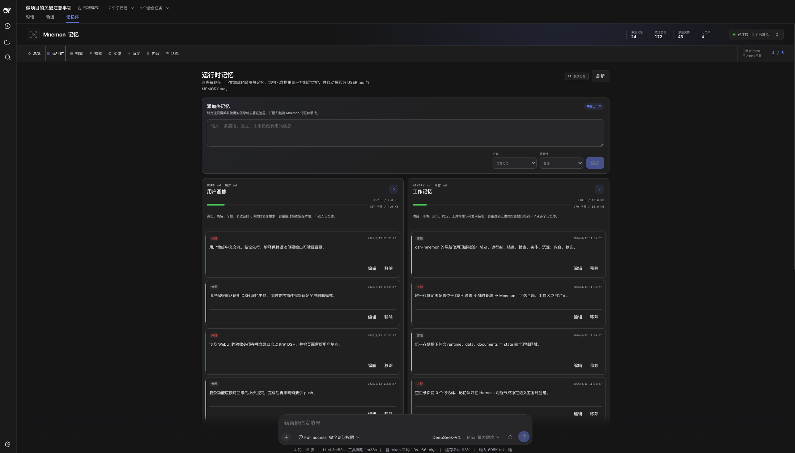
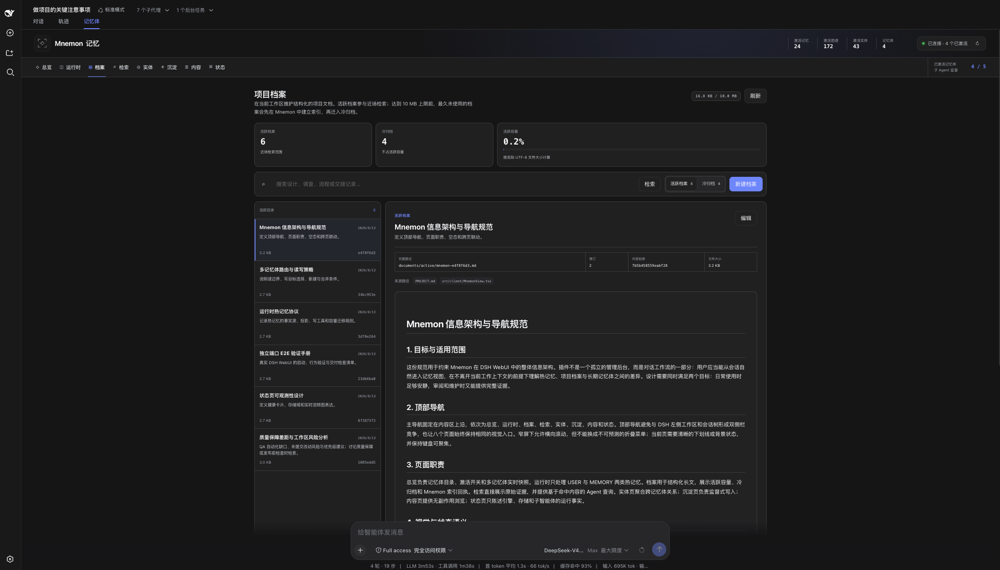
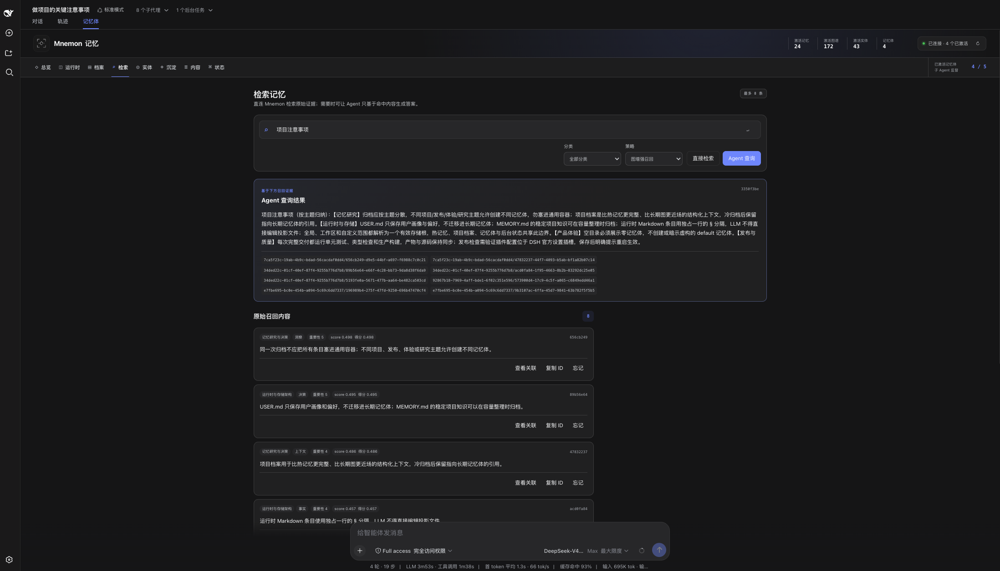
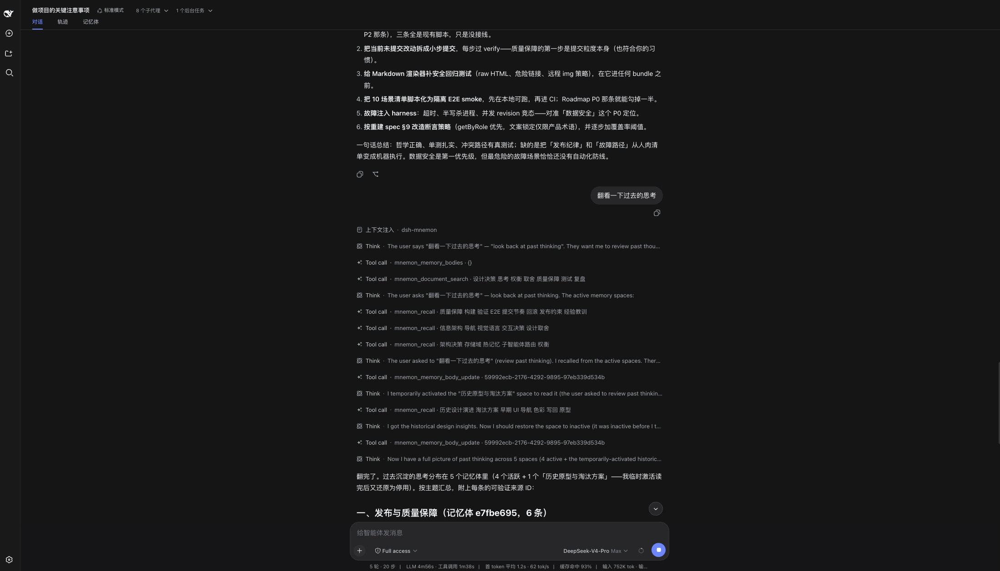
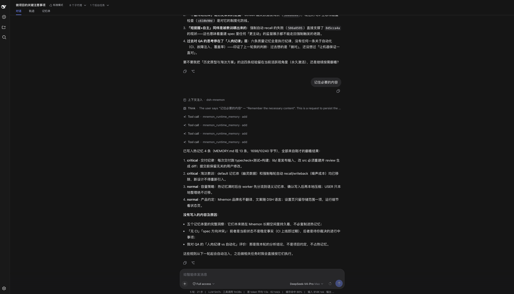
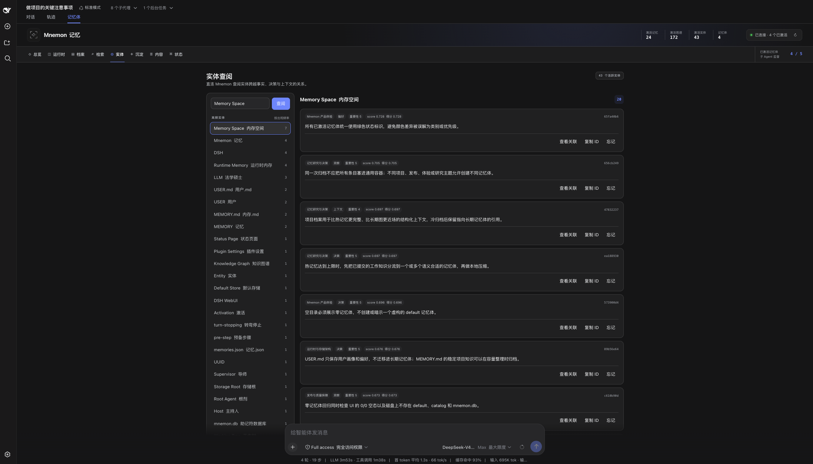
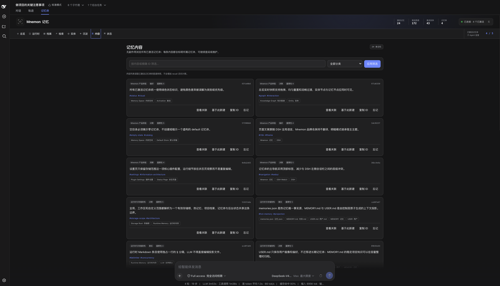

# Project Overview: Local Three-Tier Memory for DSH

[简体中文](../zh-CN/project-overview.md) | **English** | [Documentation Center](./README.md)

`dsh-mnemon` is a local Mnemon memory plugin for DeepSeek Harness (DSH). Instead of forcing every context problem into one database, it separates what must be visible every turn, project knowledge that should remain readable as a whole, and long-term history recalled across sessions. DSH then supplies supervision, routing, lifecycle integration, and the user interface.

The central goal is to give an Agent long-term continuity while keeping the current task authoritative, context compact, writes auditable, and original data protected when maintenance fails.

[](../zh-CN/assets/screenshots/overview-memory-graph.png)

*The overview brings the Memory Space catalog, activation state, statistics, and live multi-space graph into one workspace. Select the image for its original resolution. The screenshot uses the Chinese locale; the workspace also supports English.*

## Why It Exists

With only the current conversation, an Agent cannot reliably carry forward user preferences, project conventions, and historical decisions. Injecting the entire history into every prompt causes context growth, stale-information interference, and additional cost. A single long-term database also cannot satisfy all of these needs well:

| Need | Problem with a single store | dsh-mnemon approach |
|---|---|---|
| Make stable preferences and conventions available next turn | Retrieval adds latency and can miss | Runtime Memory injects compact projections every turn |
| Read a complete design, investigation, or procedure quickly | Fragmentation destroys narrative structure | Documents preserve searchable Markdown originals |
| Find cross-session facts, decisions, and relationships | Loading everything pollutes current context | Memory Spaces recall graph-enhanced evidence on demand |
| Keep infrequently used long-form material traceable | Keeping it hot consumes capacity forever | Create a durable cold reference before moving the original |
| Let a model judge value without delegating system safety | LLM output cannot guarantee paths, concurrency, or transactions | The LLM owns semantic judgment; the Host owns hard boundaries |

## Positioning

`dsh-mnemon` is an integration and supervision layer, not a new memory database:

- **DSH** provides the root Agent, lifecycle events, tools, commands, settings, Web extension points, and subagent providers.
- **dsh-mnemon** provides the three-tier control plane, routing guidance, capacity maintenance, concurrency barriers, permission boundaries, and bilingual workspace.
- **The Mnemon CLI** provides local SQLite Stores, four relationship graphs, deterministic retrieval, relationship traversal, and durable writes.

Current user instructions, live tool results, and repository facts always take precedence over historical memory. The plugin supplies reviewable evidence; it does not let old content override current facts.

## Architecture at a Glance

[](./assets/project-architecture.svg)

The architecture has four useful boundaries:

1. **Interaction boundary**: users reach memory through DSH conversations, `/mnemon` commands, model tools, and the Web workspace.
2. **Supervision boundary**: lifecycle hooks provide only short cues; durable recall, semantic writes, and maintenance run in bounded subagents.
3. **Deterministic control boundary**: the Host validates inputs, paths, permissions, revisions, UTF-8 capacity, locks, timeouts, and process arguments.
4. **Local data boundary**: Runtime, Documents, and Memory Spaces share the selected `storageRoot`; no remote memory service is required.

See [Architecture](./architecture.md) for detailed module ownership, root/worker dual paths, and RPC trust boundaries.

## The Three-Tier Memory Model

### 1. Runtime Memory: Hot Context Visible Every Turn

Runtime Memory contains compact, frequently used stable information:

- `target=user`: identity, role, long-term preferences, habits, communication style, and explicit collaboration requirements;
- `target=memory`: project conventions, environment facts, decisions, tool behavior, and reusable lessons.

`runtime/memories.json` is the only source of truth. `USER.md` and `MEMORY.md` are deterministic projections injected into every prompt. USER is limited to 4 KiB, MEMORY to 10 KiB, and a single entry to 8 KiB, all measured as UTF-8 bytes.

Ordinary `add`, `replace`, and `remove` operations are handled by the deterministic control layer. Maintenance starts only when an `add` overflows: USER is conservatively compacted by a no-tool local worker, while MEMORY is semantically archived by a bounded worker before hot candidates are compacted. An overflowing `replace` is rejected and does not trigger automatic maintenance.

[](../zh-CN/assets/screenshots/runtime-memory.png)

*The Runtime page places the USER and MEMORY projections side by side with their capacity, importance, categories, and per-entry edit controls.*

### 2. Project Documents: Complete, Readable Project Knowledge

Documents preserve knowledge that is larger than one memory item but still needs fast, complete reading: architecture rationale, investigation findings, operating procedures, incident reviews, and implementation handoffs. Bodies remain Markdown and are searched deterministically by title, description, and content.

A body is limited to 2 MiB, and rendered active Documents are limited to 10 MiB in total. When capacity is insufficient or a user archives manually, a bounded worker first writes a Mnemon cold reference containing a summary and SHA-256. The original moves to `archived/` only if its Document revision is still current. This ordering protects the active original, but it is not a rollback-capable distributed transaction across SQLite and the filesystem.

Document sharing follows `storageScope`. Under `global` or `custom`, several workspaces may share one Document index. The live session workspace constrains new `sourcePaths`; it does not create separate ownership.

[](../zh-CN/assets/screenshots/documents-markdown.png)

*The Documents page preserves both metadata and Markdown structure, combining list selection, search, and complete reading in one view.*

### 3. Memory Spaces: Isolated Long-Term Recall

Each Memory Space corresponds to a native named Mnemon Store with its own `mnemon.db`. The plugin adds a stable ID, a human-readable name, a routing description, and an active state.

- Reads cover active Memory Spaces only.
- Writes may target any registered Memory Space.
- A successful write to an inactive target activates it automatically.
- When creating a space, the model proposes the semantic name and boundary while the Host generates its stable ID.
- Merge uses non-destructive import; source databases remain and are inactive by default afterward.

The long-term layer retains `temporal`, `semantic`, `causal`, and `entity` relationships. Recall results include their Memory Space provenance and memory ID so the root Agent can traverse related context.

See [Storage and the Three-Tier Memory Model](./storage-model.md) for directory layouts, capacity details, and data authorities.

## How One Request Uses Memory

The plugin follows a near-to-far lookup gradient:

1. Prefer the current request, live tool results, and repository facts.
2. The root Agent can already see Runtime Memory injected for the turn.
3. Search active Documents deterministically when complete project knowledge is needed.
4. Use supervised recall for historical decisions, cross-session facts, or relationships.
5. Follow a cold reference to an archived Document only when the complete original is required.

When the root Agent calls `mnemon_recall`, the coordinator starts an isolated worker. The worker may only inspect the Memory Space catalog, recall, and traverse related items. It selects active spaces by name and description and returns bounded structured evidence. Raw routing reasoning and the complete catalog do not enter the main conversation.

Direct Web search uses the deterministic service. “Agent search” performs the same retrieval first, then starts a no-Mnemon-tool evidence-only worker that can answer solely from the supplied hits and return only valid citations.

[](../zh-CN/assets/screenshots/recall-agent-answer.png)

*Agent search restricts evidence to the current hits while retaining source memory IDs and raw recall entries so the answer remains reviewable.*

## How Writes and Maintenance Are Supervised

The plugin separates semantic judgment from system guarantees:

| LLM / worker responsibility | Hard Host guarantee |
|---|---|
| Decide whether content deserves long-term retention | Input schema and operation permissions |
| Select the narrowest suitable Memory Space | Paths cannot escape workspace boundaries |
| Identify duplicates, conflicts, and semantic clusters | CLI uses argument arrays with no shell |
| Produce summaries, routing decisions, and relationship reasons | Timeouts, cancellation, output limits, and process serialization |
| Decide whether complex work produced a reusable Document | File locks, temporary files, rename, and revision fences |
| Perform conservative maintenance within its persona | UTF-8 capacity accounting and preservation on failure |

Regular durable recall and semantic writes prefer an isolated provider named `spawn`. Score-based background review strictly requires a provider named `fork` with `inheritsParentContext=true`. Both paths require `outputSchema`, `toolFilter`, `persona`, and `depthLimit` support.

Background review starts only after deterministic activity scoring over completed turns reaches its threshold and the root Agent remains idle. A new turn cancels a pending or running review while retaining the in-process activity watermark. The current review can maintain hot memory and at most one Document; it cannot directly call durable `remember` / `forget` tools. “At most one” is a persona constraint, not a Host-side mutation counter.

See [Lifecycle and Core Workflows](./workflows.md) for recall, writes, capacity maintenance, cold archiving, and the scoring formula.

## End-to-End Example: Retaining an Architecture Decision

Suppose a substantial task establishes that “every external CLI must be launched with an argument array and without a shell,” and also produces a complete threat analysis and migration guide:

1. The frequently used operating rule can enter `MEMORY.md` as a compact fact and become visible from the next turn.
2. The complete analysis and migration procedure belong in an active Document, preserving headings, code excerpts, and source files.
3. If the decision should remain recallable across projects, a bounded worker selects a suitable Memory Space, checks for duplicates, writes a self-contained decision, and may link it to related security principles.
4. When someone later asks why shell command concatenation is forbidden, the Agent sees the hot rule first, searches the Document for rationale, and recalls Mnemon evidence only when cross-session relationships matter.
5. If the Document becomes infrequently used and active capacity is needed, the plugin writes a cold reference with its summary and hash before moving the original. The full analysis remains traceable through that reference.

The same knowledge can therefore retain complementary expressions at different frequencies and narrative granularity, without copying the entire Document into every prompt or stretching one short rule into a long record.

## Recall and Writeback in a Real Conversation

When a user asks to revisit earlier thinking, the root Agent can inspect the Memory Space catalog and project Documents before recalling from active spaces. If an inactive space is genuinely needed, a controlled workflow can activate it temporarily and restore its prior state after reading. The tool trace makes lookup order, space selection, and provenance observable.

[](../zh-CN/assets/screenshots/conversation-recall.png)

When a user explicitly asks to retain stable information, the root Agent writes individual items through structured Runtime Memory tools while the Host continues to validate the target, capacity, and revision. The final response reports what was actually stored instead of treating internal reasoning as persistence.

[](../zh-CN/assets/screenshots/conversation-writeback.png)

## User and Integration Surfaces

### Web Workspace

The conversation's “Memory” tab contains eight pages:

| Page | Primary purpose |
|---|---|
| Overview | Memory Space catalog, activation controls, and a live multi-space graph |
| Runtime | USER / MEMORY hot context, capacity, and deterministic maintenance |
| Documents | Search, read, edit, and cold-archive managed Documents |
| Recall | Direct recall, related traversal, and evidence-only Agent search |
| Entities | Frequent entities and their cross-graph context |
| Distill | Give a candidate to a bounded worker for deduplication, routing, and writing |
| Content | Browse, copy, clone, or soft-delete durable memories |
| Status | CLI, storage scope, lifecycle, and subagent diagnostics |

The primary Web workspace and settings card support Chinese and English and follow DSH's global light/dark theme. Commands, tool cards, and some backend diagnostics are not yet fully internationalized.

[](../zh-CN/assets/screenshots/entities-context.png)

*The Entities page ranks names by hit count and retains related memories, category, importance, score, and Memory Space provenance on the right.*

[](../zh-CN/assets/screenshots/memory-content.png)

*The Content page supports filtering and inspection, then exposes relationship lookup, create-from-current, ID copy, and soft-delete actions.*

### Model Tools and Commands

The plugin registers read and write groups of `mnemon_*` model tools and provides:

```text
/mnemon status
/mnemon recall <query>
/mnemon related <full memory ID>
/mnemon remember <stable, self-contained durable insight>
/mnemon forget <full memory ID>
```

Web RPC is an internal bridge between the DSH Host and the plugin client: reads require `trusted-host`, while memory writes and settings require `loopback`. These channels are not a stable external HTTP SDK. See [WebUI, Tools, Commands, and RPC](./interfaces.md) for the complete interface matrix.

## Local-First Reliability Design

- **Local data**: SQLite, the registry, Runtime JSON, and Documents live under the user-selected root.
- **No-shell execution**: the Mnemon CLI uses `spawn(command, args, { shell: false })`.
- **Bounded processes**: each call has a timeout, cancellation, and a 2 MiB combined stdout + stderr limit.
- **Concurrency control**: Runtime and Documents use in-process queues and cross-instance lock files; CLI calls are serialized within one Runner.
- **Original-first protection**: revision conflicts, worker failures, and invalid receipts never use stale results to overwrite current hot memory or move an active Document.
- **Recoverable projections**: a valid `memories.json` can rebuild `USER.md` and `MEMORY.md`.
- **Least-privilege workers**: every worker has a fixed persona, tool allowlist, structured output, and `maxDepth: 1`.

These boundaries are not a secret scanner or a complete backup system. There is no deterministic credential detection, cross-system rollback, built-in consistent snapshot, or general corruption repair tool yet. Production data needs independent backup and recovery rehearsals; see [Operations, Security, and Troubleshooting](./operations.md).

“Local-first” describes persistence location and CLI execution. It does not guarantee that selected content never leaves the device. If the DSH root model or subagent provider runs remotely, relevant prompts, candidates, or recalled evidence may still be sent to that provider; the actual data-processing boundary depends on the configured DSH model providers.

## Good Fits

`dsh-mnemon` is useful when:

- long-running collaboration needs stable user preferences and working conventions;
- a large project needs design rationale, investigation records, and handoff knowledge;
- several knowledge domains need isolated storage, selective activation, and cross-space recall;
- data should remain local while an LLM handles semantic judgment;
- users need a visible, editable, diagnosable memory experience native to DSH.

It is not intended for bulk persistence of secrets, raw logs, short-lived progress, or ordinary facts that can be reconstructed from the repository. It should not be treated as the source of truth, an authorization system, a backup system, or a proactive notification daemon.

## Current Limitations

- `writeEnabled=false` is feature-level read-only behavior, not a read-only-filesystem guarantee; reads may still repair projections, update Document LRU metadata, or trigger upstream migrations.
- `tabEnabled=false` currently stops Host Mnemon data RPC only; the client Tab may still appear.
- Background-review watermarks exist only in Host process memory and do not survive restart.
- Under `global` / `custom`, Documents may be shared across workspaces without separate workspace ownership.
- The planned cold-reference path in the worker prompt can differ from the actual absolute location outside workspace scope.
- The project does not yet publish a formal compatibility matrix for DSH, Mnemon, Node, and persistent data formats.
- Real DSH + Mnemon WebUI E2E remains primarily a manual pre-release verification process.

These gaps and priorities are tracked in the [Roadmap](./roadmap.md).

## Continue Reading

- To run it now: read [Getting Started](./getting-started.md).
- To understand code boundaries: read [Architecture](./architecture.md).
- To choose a data scope: read [Storage and the Three-Tier Memory Model](./storage-model.md) and the [Configuration Reference](./configuration.md).
- To understand transactions and review: read [Lifecycle and Core Workflows](./workflows.md).
- To deploy or upgrade: read [Operations, Security, and Troubleshooting](./operations.md).
- To contribute: read [Development and Verification](./development.md).
