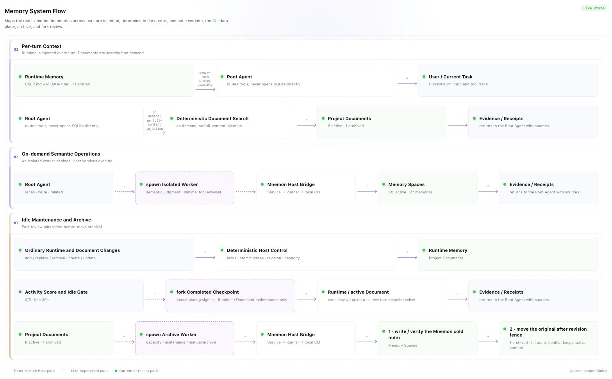

# Project Overview: Local Three-Tier Memory for DSH

[简体中文](../zh-CN/project-overview.md) | **English** | [Documentation hub](./README.md)

`dsh-mnemon` integrates [Mnemon](https://github.com/mnemon-dev/mnemon) Memory Spaces with DeepSeek Harness, then adds Runtime hot memory, Project Documents, lifecycle routing, bounded subagents, a deterministic control layer, and native DSH interfaces.

Its goal is not to store more text. It balances long-term continuity, current-fact priority, context cost, and recoverable writes.

## Why three tiers

One memory tier cannot serve frequent injection, full-document reading, and cross-session recall equally well:

| Need | With one memory tier | dsh-mnemon's choice |
|---|---|---|
| Know stable preferences and rules on the next turn | Retrieval adds latency and may miss | Inject compact Runtime projections every turn |
| Read a complete design, investigation, or procedure | Fragmentation loses narrative and provenance | Keep managed Markdown Documents |
| Find cross-session facts, decisions, and relations | Full loading pollutes context | Recall bounded graph-enhanced evidence on demand |
| Preserve traceability for cold long-form material | Keeping it hot consumes capacity forever | Create a cold reference before moving the original |
| Let a model judge value without owning system safety | An LLM cannot guarantee paths, locks, or transactions | Workers own semantics; the Host owns hard boundaries |

Priority always remains: **current user instructions → live tools and repository facts → historical memory**.

## The three-tier model

### 1. Runtime Memory

Runtime retains compact, high-frequency information useful on many turns:

- `USER.md`: identity, roles, preferences, habits, and explicit collaboration requirements;
- `MEMORY.md`: project conventions, environment facts, decisions, tool behavior, and reusable lessons.

`runtime/memories.json` is the source of truth; both Markdown files are deterministic projections. USER is capped at 4 KiB and MEMORY at 10 KiB, measured in UTF-8 bytes. Regular mutations are deterministic; only capacity maintenance may start a worker.

### 2. Project Documents

Documents preserve complete designs, investigations, procedures, postmortems, and handoffs. Title, retrieval description, and body participate in deterministic search; the body keeps Markdown structure.

One body may be up to 2 MiB and active rendered content up to 10 MiB. Before manual or capacity archiving, a bounded worker writes a Mnemon cold reference containing a summary and SHA-256. The original moves only if its revision is unchanged. Failure or conflict preserves active content.

### 3. Memory Spaces

Each Memory Space maps to an independent Mnemon Store and `mnemon.db`, with a stable ID, name, routing description, and activation state.

- Reads cover active spaces only.
- Writes may target any registered space and activate it after success.
- Durable memory preserves temporal, semantic, causal, and entity relations.
- Recall retains Memory Space provenance and memory IDs for related traversal.

See [Storage and the three-tier model](./storage-model.md) for authoritative files, capacities, and directories.

## Architecture

Four boundaries shape the system:

1. **Interaction**: conversation, Sidebar / Buildin workbench, `/mnemon` commands, and model tools.
2. **Supervision**: durable recall, semantic writes, and archiving run in bounded workers; lifecycle hooks provide short cues and scheduling signals.
3. **Deterministic control**: the Host enforces schema, paths, permissions, capacity, locks, revisions, CLI arguments, timeouts, and cancellation.
4. **Local data**: Runtime, Documents, and Memory Spaces share the effective `storageRoot` and require no remote memory service.

### Memory System flow

This diagram describes stable execution boundaries, not a live status dashboard. Solid lines are deterministic Host paths; dashed lines require supervised LLM judgment.

The three major flows are:

- **Per-turn context**: Runtime projections enter the prompt; the Root Agent searches active Documents deterministically when needed.
- **On-demand semantics**: the Root Agent dispatches a `spawn` worker through the Host Bridge to active Memory Spaces; only bounded evidence or receipts return.
- **Maintenance and archive**: the Host applies ordinary mutations atomically; idle review uses `fork` from a completed checkpoint; Document archive verifies a cold index before moving the original across a revision fence.

See [Lifecycle and workflows](./workflows.md) for thresholds, cancellation, and failure semantics.

## Read path: near to far

A history-dependent request expands in this order:

1. current request, live tool results, and repository files;
2. Runtime Memory already in the prompt;
3. deterministic search and on-demand full text from active Documents;
4. supervised recall from active Memory Spaces;
5. archived originals only after following a cold-reference hit.

`mnemon_recall` starts an isolated worker. It selects the narrowest spaces from names and descriptions and can use only allowed recall/related tools. The complete catalog and routing trace do not fill the root conversation.

Direct recall in the Web returns raw evidence. Agent query retrieves the same evidence, then gives it to an evidence-only worker with no Mnemon tools.

## Write path: semantics versus guarantees

| Memory worker | Host guarantees |
|---|---|
| Decide whether a candidate is durable | Input schema and operation permissions |
| Select the narrowest space and deduplicate | Workspace and path confinement |
| Distill self-contained content and relation rationale | Shell-free CLI, bounded output, timeout, and cancellation |
| Decide when long-form work belongs in Documents | Locks, temporary files, rename, and revision fences |
| Maintain conservatively within its persona | UTF-8 capacity and original-data preservation on failure |

Durable recall and writes prefer isolated `spawn`. Score-based background review uses `fork` only after a completed turn crosses its threshold and remains idle. A new turn cancels pending or running review.

## What users see

The default Sidebar has four primary pages: Status, Runtime, Memory Spaces, and Documents. Memory Spaces adds Overview, Recall, Content, and Entities. Add, edit, and Remember use consistent dialogs; long collections use filters and progressive loading.

Two additive entries surface memory in conversations:

- **Turn memory** summarizes this turn's memory tools and links to matching pages.
- **Save to memory** loads a finalized reply into an editable confirmation; supervised writing starts only after confirmation.

See the [Sidebar and conversation UI guide](./ui-guide.md) for screenshots and workspace inspection/execution semantics. See [Interfaces](./interfaces.md) for tools, commands, and RPC.

## Local-first reliability

- CLI calls use argument arrays with `shell=false`, bounded output, timeout, and cancellation.
- Runtime and Documents use in-process queues, cross-instance locks, temporary files, and rename.
- Runtime revisions block stale compaction; Document revisions block movement of updated originals.
- Subagents use persona, tool allowlists, structured output, and depth limits.
- The WebUI never reads SQLite directly or supplies arbitrary update commands.
- The plugin stores no model credentials, but it does not yet include a deterministic secret scanner.

These guarantees are not a rollback-capable distributed transaction across Mnemon SQLite and the filesystem. When uncertain, the system preserves original data. See [Operations](./operations.md) for complete boundaries and limitations.

## Continue reading

- [Getting Started](./getting-started.md): installation and first verification.
- [Sidebar and conversation UI guide](./ui-guide.md): complete visual workflow.
- [Architecture](./architecture.md): modules, workers, and trust boundaries.
- [Storage model](./storage-model.md): directories, capacity, and authority.
- [Lifecycle and workflows](./workflows.md): injection, recall, writing, review, and archive.
- [Configuration](./configuration.md): display, storage, and advanced switches.
