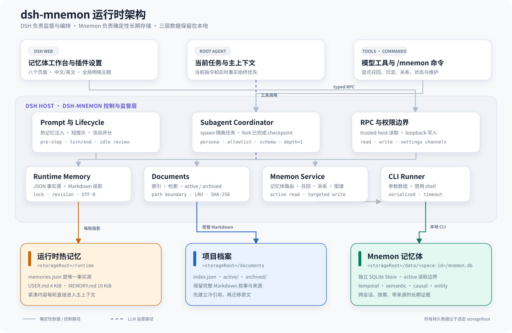

# 架构设计

**简体中文** | [English](../en/architecture.md) | [文档中心](./README.md)

## 定位

`dsh-mnemon` 是 DSH 与 Mnemon 之间的集成和监督层，不是新的数据库引擎：

- DSH 提供主 Agent、生命周期事件、subagent provider、工具、命令、设置和 Web 扩展点；
- 插件提供三层知识控制面、路由策略、事务屏障和 UI；
- 本地 `mnemon` CLI 提供命名 Store、SQLite 持久化、四类图、召回、关系和软删除。

## 组件图

[](../assets/diagrams/zh-CN/project-architecture.svg)

图中实线表示确定性数据或控制路径，紫色虚线表示 LLM 监督路径。Runtime Memory 和 Documents 直接使用受管文件；只有 Memory Spaces 通过 `MnemonRunner` 调用本地 Mnemon CLI。点击图片可以查看原始 SVG。

## Host 组合根

`src/index.ts::apply()` 按以下顺序组装插件：

```text
settings.register("mnemon")
  -> resolveConfig
  -> createRunner
  -> MnemonService
  -> RuntimeMemoryController
  -> DocumentManager
  -> StorageScopeInspector
  -> MnemonSubagentCoordinator
  -> MnemonLifecycle
  -> tools / commands / prompt sections
  -> register RPC when a Web connection exists
```

Host 声明依赖 `tools`、`settings`、`commands`、`agents` 和 `subagents`。Web client 另外依赖 slots、connection 和 DSH locale 服务。

## 主 Agent 与 worker 的双路径

同名 `mnemon_*` 工具根据调用者是否为 subagent 分流，防止递归委派：

```text
root Agent calls mnemon_recall
  -> coordinator starts a bounded recall worker
  -> worker calls mnemon_memory_bodies and mnemon_recall
  -> tool sees origin=subagent
  -> call reaches MnemonService directly
  -> structured evidence returns to root Agent
```

长期语义写入、关系、软删除以及记忆体创建/更新/合并采用相同模式。运行时记忆和 Documents 的普通变更先经过 coordinator，但通常由确定性控制层直接提交；只有容量维护或归档需要额外 worker。

记忆体目录的物理删除是单独的确定性危险操作：WebUI 必须先展示二次确认，随后经 loopback 写 RPC 调用 Mnemon 原生 `store remove`；只有 CLI 删除成功后才移除目录登记。

## 两类子 Agent

### `spawn`

`spawn` 使用新的隔离上下文。插件为每类任务提供：

- 固定 persona；
- 最小工具白名单；
- DSH 支持子集内的结构化输出 schema；
- `maxDepth: 1`；
- 可取消的 signal 和有界 token 预算。

它用于召回、长期语义写入、证据限定问答、热记忆整理和 Document 归档。

### `fork`

评分后台审查必须使用名为 `fork` 且 `inheritsParentContext=true` 的 provider。它只继承已经完成的父 checkpoint，用于判断是否需要维护热记忆或最多一份项目档案。它不是用户任务的延续，也不会把审查推理注入主对话。

当前审查白名单不包含 `mnemon_remember`、`mnemon_forget` 或记忆体维护工具，因此后台审查不会直接修改长期记忆体。

## 控制面与数据面

```text
LLM-owned judgment                  Host-owned guarantees
------------------                  ---------------------
what is worth keeping               input validation
which Memory Space fits             path boundary
whether two items are duplicates    process timeout/cancel
how to summarize a Document         file lock + atomic rename
whether a reusable artifact exists  UTF-8 capacity accounting
                                     revision conflict rejection
                                     read/write RPC authority
```

必须区分“persona 约束”和“Host 硬保证”。例如 MEMORY 归档 worker 被要求覆盖每条已提交热记忆，但 Host 只能硬校验结构化 action、revision 和字节预算；USER 压缩的 source coverage 则由 Host 逐项验证。

## Web 边界

WebUI 不启动系统进程，也不直接打开 SQLite：

```text
browser component
  -> typed client wrapper
  -> DSH RPC authority check
  -> Host validation
  -> controller / service / bounded worker
  -> local CLI or managed files
```

读通道要求 `trusted-host`，记忆写通道和设置通道要求 `loopback`。`writeEnabled=false` 时 Host 不注册记忆写通道。

## 国际化

`src/client/locales.ts` 以中文键集定义 `MnemonKey`，英文词典必须满足同一键集合；`src/client/index.ts` 把两套词典注册到 DSH locale。主要 Web 页面和设置卡随 DSH 全局语言即时切换，并复用全局明暗主题。

当前命令输出、工具卡标题、持久化的兼容默认记忆体名称和部分后端错误仍是单语，这是 Roadmap 中的已知缺口。

## 关键模块

| 模块 | 职责 |
|---|---|
| `src/index.ts` | Host 组合与注册 |
| `src/config.ts` | 配置 schema、默认值和解析 |
| `src/process.ts` | 无 shell 的有界进程执行 |
| `src/runner.ts` | CLI 发现、参数、序列化和 JSON 解析 |
| `src/service.ts` | 长期记忆应用门面 |
| `src/memory-bodies.ts` | Memory Space 目录元数据 |
| `src/runtime-memory.ts` | 热记忆事实源与投影 |
| `src/documents.ts` | Documents 控制面 |
| `src/subagent.ts` | worker 编排与容量事务 |
| `src/lifecycle.ts` | per-root-Agent 生命周期 |
| `src/review-activity.ts` | 确定性审查评分 |
| `src/tools.ts` | 模型工具及 root/worker 分流 |
| `src/rpc.ts` | Web 读写通道 |
| `src/storage-scope.ts` | 三种存储范围的只读盘点 |
| `src/client/*` | Web 工作台、设置和 locale |
