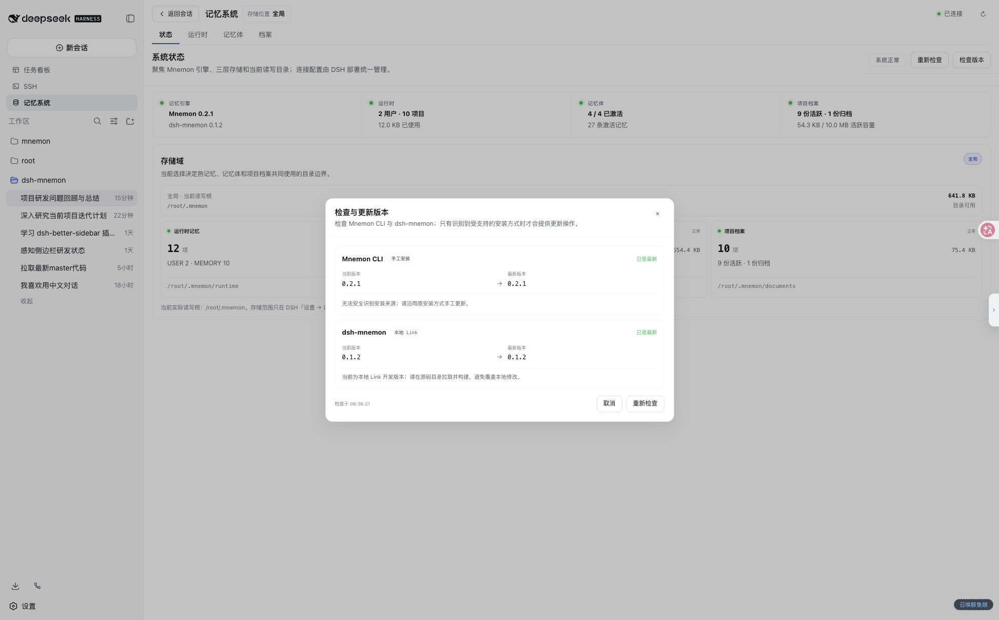
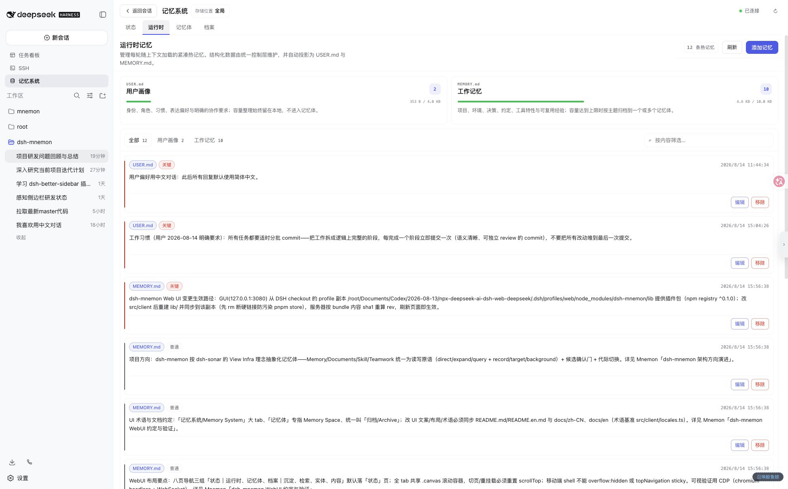
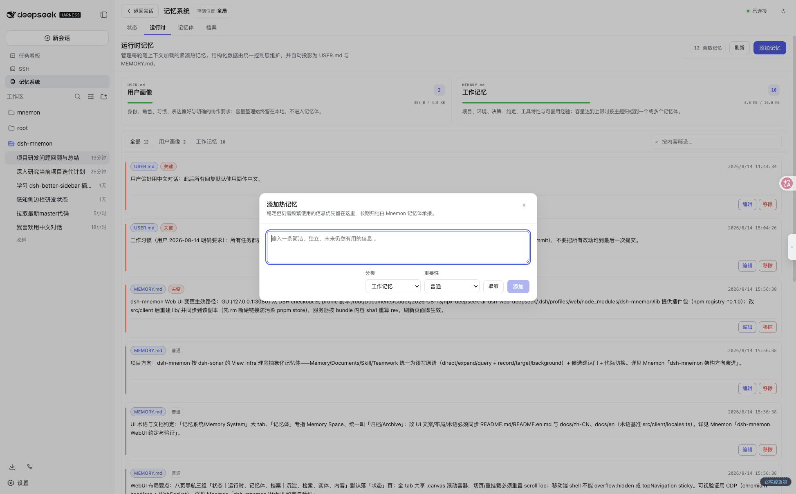
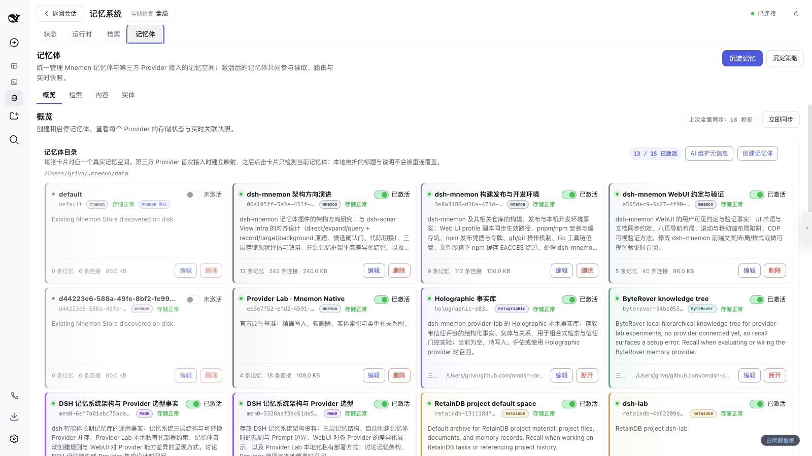
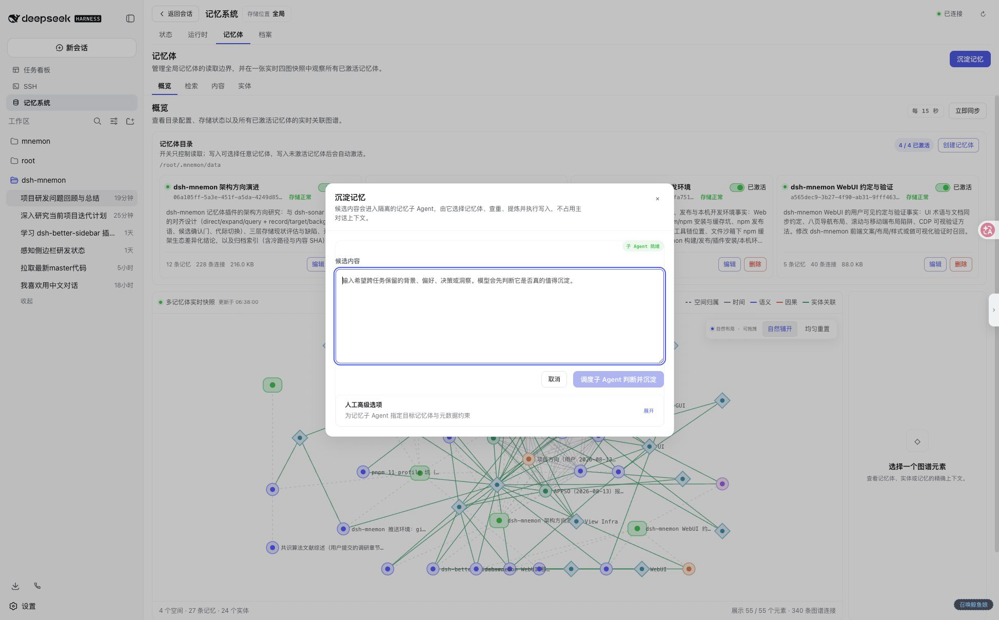
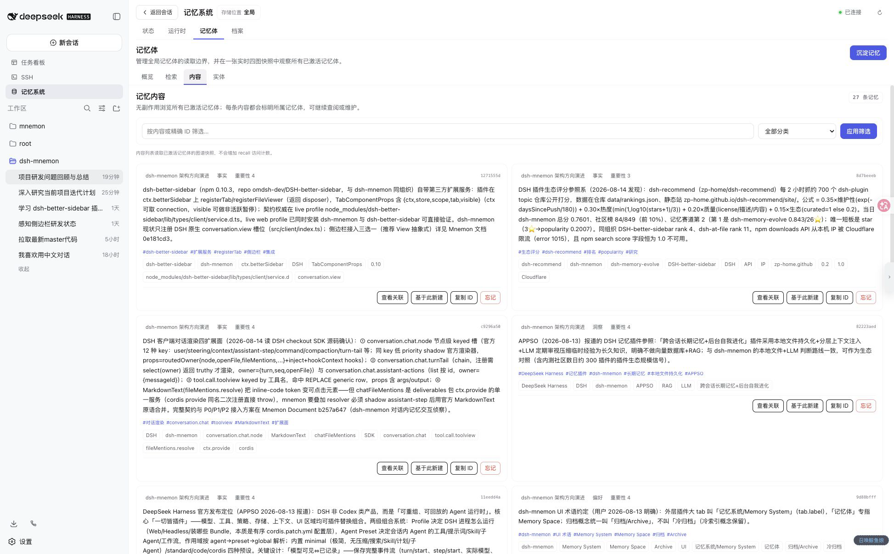
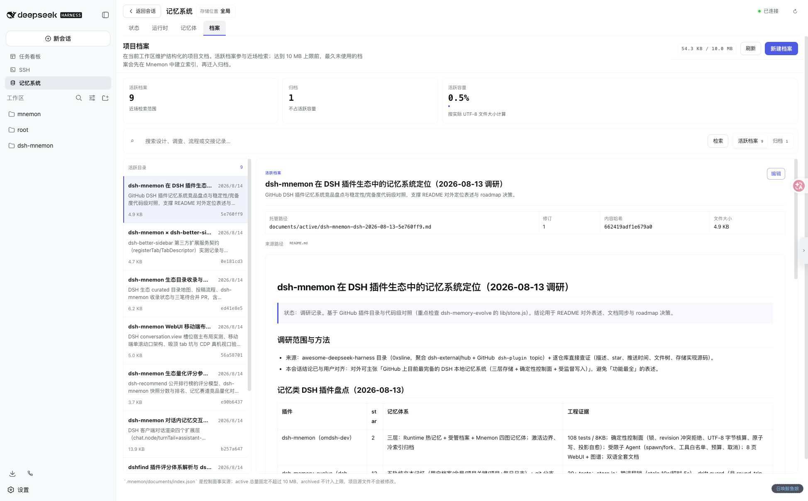
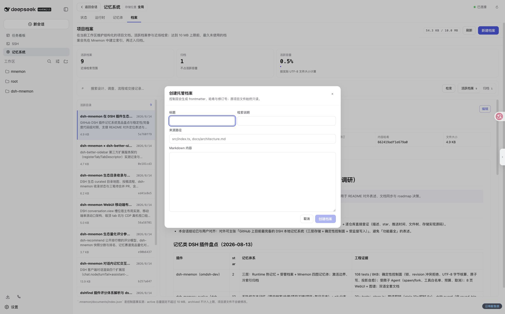
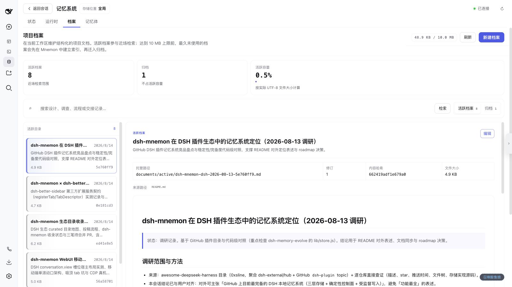
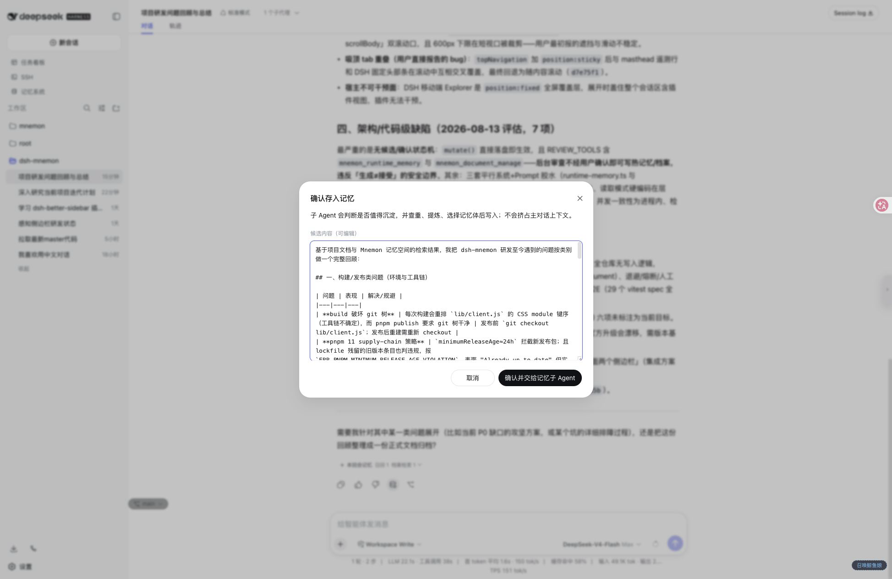

# Sidebar 与对话交互指南

**简体中文** | [English](../en/ui-guide.md) | [文档中心](./README.md)

本指南以默认的 `sidebar` 形态为主，按真实使用路径介绍记忆系统。截图来自 v0.1.5 实机界面；数量、名称和内容会随你的数据变化。

## 先认识两种展示形态

在 DSH 的“设置 → 记忆系统”中选择入口与存储位置：

| 形态 | 适合场景 |
|---|---|
| **Sidebar**（默认） | 从 DSH 左侧栏进入独立工作台；外观与任务看板、SSH 等官方面板一致，适合日常管理 |
| **Buildin** | 在对话区内打开原有标签页；保留之前的布局和视觉，适合依赖旧工作流的用户 |

两种形态共享功能、数据和 Host 服务，只拆分入口与外观。保存后实时切换，不需要刷新浏览器，也不会同时挂载两个入口。

## 工作台结构

Sidebar 顶部始终回答三个问题：

1. 现在打开的是“记忆系统”；
2. 存储位置使用全局、工作区还是自定义模式；
3. Host 是否已连接。

主体只有四个一级标签：**状态、运行时、记忆体、档案**。记忆体内部再分为**概览、检索、内容、实体**；“沉淀记忆”固定为这一层的主要动作。

## 1. 状态：先确认系统是否可用

状态页聚合以下信息：

- Mnemon CLI 与 dsh-mnemon 当前版本；
- USER / MEMORY 运行时条目数；
- 已激活记忆体与长期记忆数量；
- active / archived 档案数量；
- 当前存储根，以及 Runtime、Documents、Memory Spaces 三个实际目录。

如果这里显示异常，先不要沉淀或归档；从[故障排查](./operations.md#故障排查)开始检查。

### 检查与更新版本

点击版本区域会打开只读检查面板：

检查不会自动安装。只有识别到受支持的安装来源并发现新版本时，才会出现“更新”。更新完成后界面会自动重新检查并刷新系统状态；dsh-mnemon 更新后仍需重启 `dsh web` 才能加载新代码。

## 2. 运行时：管理每轮都会使用的热记忆

页面上方分别显示用户画像（`USER.md`）和工作记忆（`MEMORY.md`）的条目与容量；下方是统一列表。

- 用“全部 / 用户画像 / 工作记忆”筛选范围；
- 用右侧输入框按内容筛选；
- 标签显示来源和重要性；
- “编辑”打开弹窗，“移除”进入危险操作流程；
- 长列表通过“再显示 N 条”逐步展开。

### 添加运行时记忆

一条运行时记忆应当简洁、独立、未来仍然常用。用户身份、偏好与明确协作要求放入“用户画像”；项目、环境、决策和工具经验放入“工作记忆”。临时进度、原始日志和一次性事实不适合这里。

## 3. 记忆体：管理长期记忆与关系

### 概览

目录卡片先展示名称和路由说明，右上角是读取激活开关，底部是统计与编辑 / 删除操作。激活只控制读取范围；写入可以选择已登记但未激活的目标，成功后会自动激活。

下方关系图聚合全部已激活记忆体。布局、拖拽和重置只影响当前浏览器展示，不会修改 Mnemon 数据。

### 沉淀记忆

默认只需填写候选内容。确认后，隔离的记忆子 Agent 会判断是否值得保存、选择最窄记忆体、查重、提炼并写入。“人工高级选项”只用于确实需要约束目标记忆体、分类或重要性时。

### 检索

- **直接检索**返回原始证据，不启动回答 Agent；
- **Agent 查询**先取得相同证据，再让无 Mnemon 工具的 evidence-only worker 组织答案；
- 分类与策略可以缩小范围；
- 结果保留记忆体来源、分类、重要性、分数与 ID；
- “查看关联”继续沿图遍历，“忘记”属于破坏性语义操作。

使用具体问题比宽泛关键词更可靠。例如“这个项目为什么禁止 shell 拼接？”通常优于“项目架构”。

### 内容与实体

| 内容 | 实体 |
|---|---|
|  |  |

- **内容**用于无召回副作用地浏览长期记忆，并按文本或分类筛选；可以查看关联、基于当前内容新建、复制 ID 或忘记。
- **实体**先显示高频实体，选择或输入名称后聚合跨事实、决策与上下文的相关记忆。

两页都采用可见数量 / 总数和加载更多，避免大量数据一次撑满页面。

## 4. 档案：保留完整项目叙事

档案适合设计、调查、流程、复盘和交接。左侧目录分批加载，右侧保留标题、检索说明、来源、revision、哈希、文件大小与完整 Markdown；切换文档时阅读区会回到顶部。

达到 active 容量上限前，最久未使用的档案会先在 Mnemon 中建立冷引用，再迁入 archived；失败或 revision 冲突时保留 active 原文。

### 新建档案

标题与检索说明决定未来是否容易找到，来源路径用于追溯；正文保留 Markdown 结构。原项目文件始终只读，工作台创建的是受管副本。

## 5. 对话内交互

### 本回合记忆

只有已完成且发生记忆活动的回合才显示这一行。展开后列出具体工具；点击工具名会打开对应页面，并保留当前会话上下文。

### 存入记忆

“存入记忆”位于已定稿助手回复的原生操作区。点击只会打开确认弹窗并读取这条回复；可以修改候选或取消。只有点击“确认并交给记忆子 Agent”才会执行写入流程。

## 工作区模式：查看与执行分离

`storageScope=workspace` 下需要区分两个概念：

| 概念 | 由什么决定 | 影响什么 |
|---|---|---|
| **查看工作区** | 工作台顶部的工作区选择器 | 当前页面展示和人工维护哪套 `<workspace>/.mnemon` |
| **执行工作区** | 当前对话 / Agent 的 cwd | 工具、命令、生命周期与子 Agent 实际使用哪套目录 |

因此，你可以留在项目 A 的对话中查看项目 B 的记忆，但 Agent 仍然使用项目 A。两者不一致时，顶部会显示提示与一键对齐；需要 Agent 子任务的操作会被 Host 拒绝，防止写错项目。切换查看工作区会先卸载旧页面状态，再加载新目录。

`global` 与 `custom` 只有一个明确存储根，不需要这层对齐。

## 常见交互规则

- 蓝色实心按钮表示当前主要动作；蓝色描边通常用于编辑；红色用于移除、删除、归档或忘记；中性按钮用于查看、复制与取消。
- 删除记忆体等物理危险操作需要独立确认；“忘记”是长期语义软删除，也只应在明确需要时使用。
- 保存配置后页面自动清理旧状态并重新读取，无需浏览器刷新。
- Sidebar 的一级页头保持稳定；记忆体内部二级内容标题随内容自然滚动。
- Buildin 保留既有布局和视觉，功能说明仍可参考本指南，但控件位置可能不同。

下一步：[快速开始](./getting-started.md) · [存储模型](./storage-model.md) · [配置参考](./configuration.md) · [运维指南](./operations.md)
